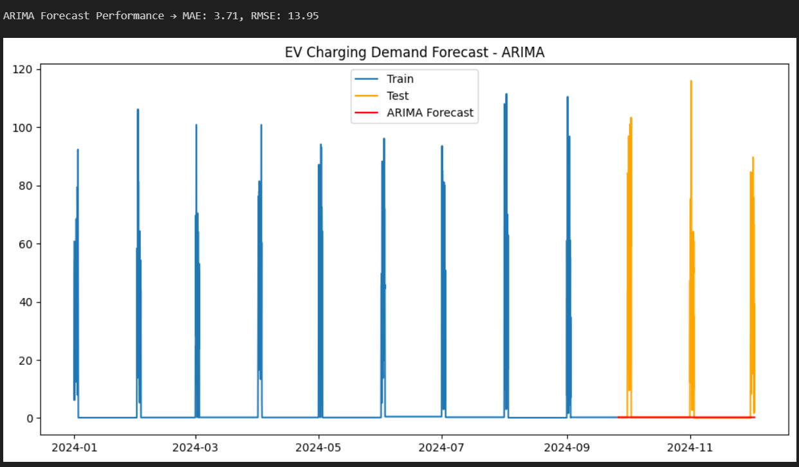
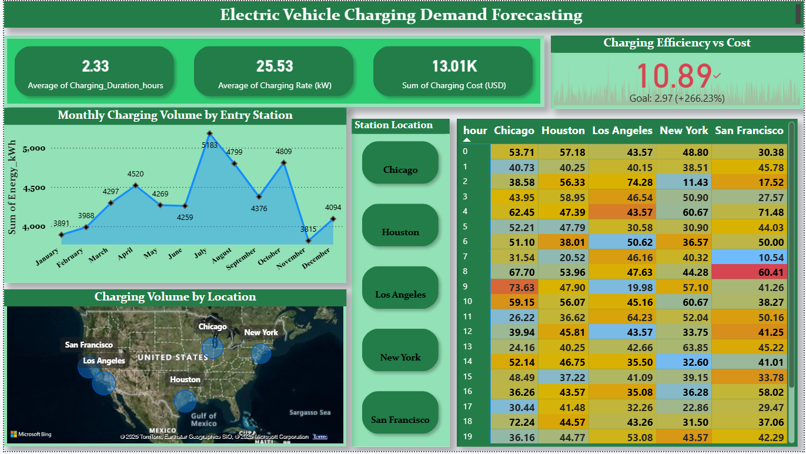
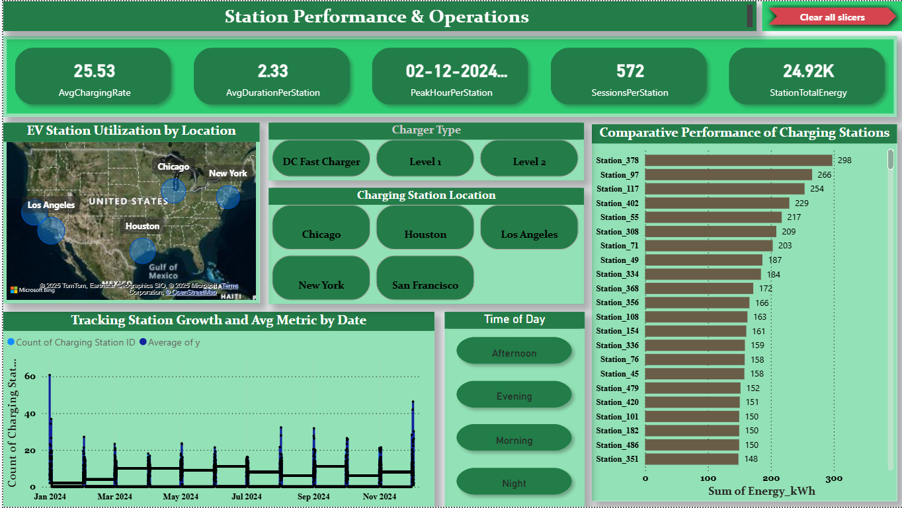
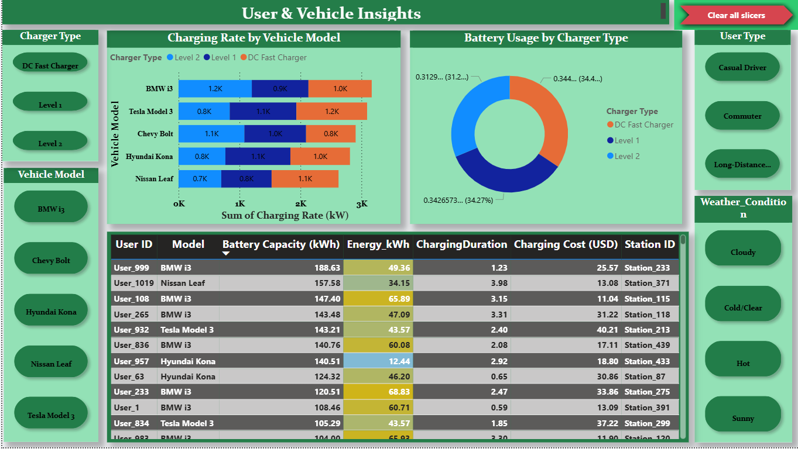
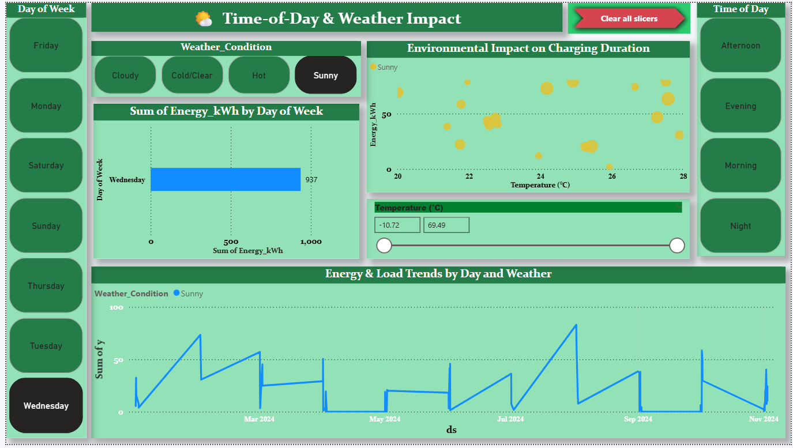
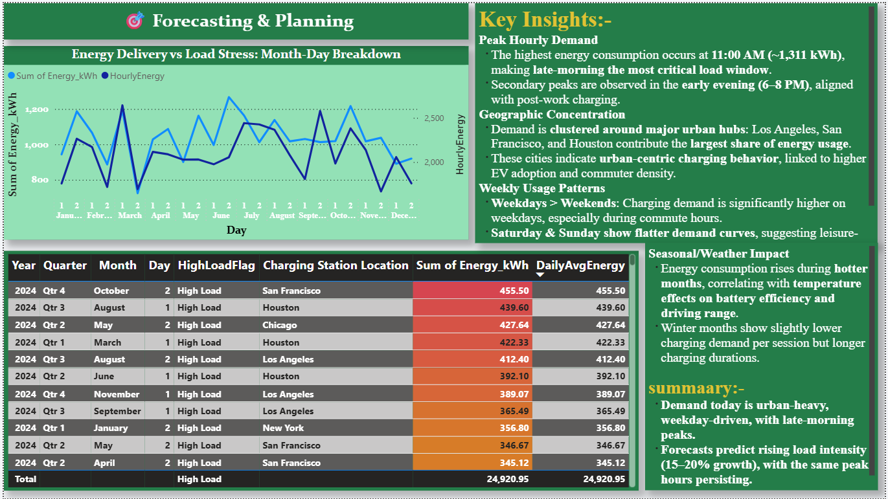

# 🚗⚡ EV Charging Demand Analysis & Forecasting

## 📌 Project Overview
The adoption of Electric Vehicles (EVs) is accelerating, driving the need for **scalable charging infrastructure**.  
This project analyzes EV charging behavior across a nationwide network to uncover:  

- **When** peak charging demand occurs  
- **Where** charging is most concentrated  
- **How** usage patterns differ by users, vehicles, and weather conditions  

An **interactive Power BI dashboard** and **time-series forecasting models** are developed to support **energy providers, policymakers, and urban planners** in optimizing EV infrastructure deployment.  

---

## 🎯 Business Objectives
- Identify **network-wide charging demand trends** and peak load periods.  
- Understand **station-level utilization** and geographic demand clusters.  
- Analyze **user and vehicle-level charging behavior**.  
- Forecast **future energy demand** using ARIMA/Prophet.  
- Provide **executive-ready KPIs** for decision-making.  

---
## 🔄 Project Workflow  
Raw Data → Preprocessing → EDA → Forecasting → Dashboard → Insights

## 📊 Datasets

| Dataset | Shape | Description | Total Energy (kWh) |
|---------|--------|-------------|--------------------|
| **Sessions** (`dashboard_sessions.csv`) | (572, 21) | User, vehicle, charging session, and environmental attributes | 24,920.95 |
| **Network-Hourly** (`dashboard_network_hourly.csv`) | (8,088, 2) | Hourly charging energy consumption across the network | 24,920.95 |
| **Station-Hourly** (`dashboard_station_hourly.csv`) | (29,122, 3) | Hourly usage by individual charging stations | 24,920.95 |

Additional Files:  
- **Python Notebook** – `EV_Charging Demand Forecasting.ipynb`  
- **Power BI Dashboard** – `EV_Charging Demand Forecasting_dashboard.pbix`  

---

## 🔍 Methodology

1. **Data Preparation**  
   - Cleaned and standardized datetime, session, and weather fields.  
   - Verified energy consumption consistency across all datasets (**24,920.95 kWh**).  
   - Derived features: charging duration, charging rate, peak hour flags.  

2. **Exploratory Data Analysis (EDA)**  
   - Network-level demand curves (hourly, daily, weekly).  
   - Station-level comparisons and geographic heatmaps.  
   - User segmentation by charger type and vehicle model.  

3. **Forecasting**  
   - **ARIMA model applied to hourly demand**.  
   - **Performance Metrics**:  
     - MAE: **3.71**  
     - RMSE: **13.95**  
   - Forecast horizon: 1 week, 1 month.  
   - Prophet considered for long-term trend capture.  

4. **Dashboard Development (Power BI)**  
   - Built interactive KPI cards, time-series charts, heatmaps, and maps.  
   - Drill-through enabled: Network → Station → Session.  
   - Key KPIs tracked:  
     - **Total Sessions**: 572  
     - **Total Energy Consumed**: 24.92 MWh  
     - **Peak Hour**: 8 AM  
     - **Peak Demand**: 1,231.12 kWh  
     - **Best Weather Condition for Charging**: Cloudy  

---
## 📈 Key Findings
- **Total Sessions**: 572  
- **Total Energy Consumed**: 24.92 MWh  
- **Peak Hour**: 8:00 AM  
- **Peak Demand**: 1,231.12 kWh  
- **Best Weather Condition**: Cloudy (highest charging activity)  
  
---

## 🔑 Key Insights

- **Peak Demand**: Maximum energy load occurs at **8:00 AM (~1,231 kWh)**.  
- **Dashboard KPIs**:  
  - Total Sessions: **572**  
  - Total Energy: **24.92 MWh**  
  - Best Weather for Charging: **Cloudy**  
- **Geographic Hotspots**: **Los Angeles, San Francisco, and Houston** dominate charging demand.  
- **Temporal Patterns**:  
  - **Weekdays > Weekends** (commuter-driven).  
  - **Weekends** show flatter demand curves (leisure-driven).  
- **User Behavior**:  
  - Commuters rely on **fast chargers** during peak commute hours.  
  - Casual drivers use **slower chargers** with longer durations.  
- **Forecasting Performance**: ARIMA achieved **MAE = 3.71** and **RMSE = 13.95**, indicating reliable short-term demand prediction.  

---

## 📊 Network Overview

## 🏙️ Station Performance & Operations

## 👥 User & Vehicle Insights

## 🌤️ Time-of-Day & Weather Impact

## 🔮 Forecasting & Planning

## 📦 Deliverables
- ✅ Cleaned datasets (`.csv`)  
- ✅ Python forecasting notebook (`.ipynb`)  
- ✅ Power BI interactive dashboard (`.pbix`)  
- ✅ Documentation (`README.md`)  

---

## ⚙️ Tools & Technologies
- **Python (Pandas, Statsmodels, Prophet, Matplotlib)**  
- **Power BI** (visualization & reporting)  
- **Excel/CSV** (data preprocessing)  

---

## 🚀 How to Run

1. Clone this repository and download the datasets.  
2. Open **Power BI file (`.pbix`)** → refresh data source connections.  
3. Explore dashboards with filters (date, station, vehicle, weather).  
4. Run **`EV_Charging Demand Forecasting.ipynb`** for forecasting experiments.  

---

📢 This project delivers **data-driven insights** into EV charging demand, enabling **evidence-based infrastructure planning** and supporting the transition to a sustainable transportation ecosystem.  
